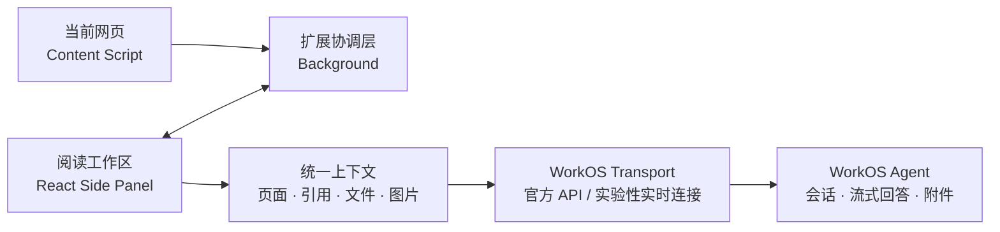

# 页脉 Yemai

> 读过的，终会连起来。

页脉是一个运行在 Chrome Side Panel 中的个人 AI 阅读助手。它把当前网页、选中的内容、文件和图片组织成可追踪的上下文，并通过影刀 WorkOS Agent 提供连续对话、流式回答、会话分支和本地工作区。

当前版本已经进入可稳定使用阶段，适合在真实网页中进行阅读、提问和资料整理。

## 核心能力

- **从当前网页开始**：读取页面标题、地址和正文；新会话可以直接介绍能力或总览当前网页。
- **普通划词引用**：选中文字后，通过网页内的轻量入口将原文加入当前问题。
- **智能框选**：启动后侧边栏暂时隐藏，鼠标移动时自动识别正文、目录和侧栏等可读内容块；点击即可引用，完成或按 `Esc` 取消后恢复侧边栏。
- **统一上下文工作台**：网页、引用、文件和图片以独立上下文项进入输入区，发送前仍可检查或移除。
- **文件与图片问答**：支持文件选择和剪贴板图片粘贴，展示上传状态、格式和来源，并随问题一起发送。
- **连续会话与工作页**：最多同时打开 10 个会话工作页；草稿、消息、上下文、远端 UUID 和打开状态均可本地恢复。
- **回答分支**：可以从任意已完成回答创建独立分支，并保留父子关系、来源导航和树状历史。
- **可切换 WorkOS 通道**：支持官方 API 和实验性实时连接，统一处理会话、附件和流式事件。
- **安全的运行反馈**：仅展示工具名称、状态和耗时，不暴露原始思维链、工具参数或完整工具输出。

## 两种引用方式

### 普通划词

适合只引用句子或段落中的一小部分。页脉读取浏览器真实文本选区，因此发送内容与用户看到的选中范围一致。

### 智能框选

适合快速引用一个完整的内容块，例如正文段落、列表、卡片、左侧导航或右侧目录。

智能框选基于页面 DOM 和可见文本工作，不是截图或 OCR：

- 优点是速度快、文字准确、无需上传页面截图。
- 边界以网页的结构化内容块为准；如果只想截取一个段落中的部分文字，应使用普通划词。
- `chrome://`、Chrome Web Store、扩展页面以及浏览器限制脚本注入的页面不支持网页内容提取。

## 使用流程

1. 打开一个普通网页，点击页脉扩展图标打开 Side Panel。
2. 在设置中填写 WorkOS Agent UUID，并配置一种可用的连接通道。
3. 直接提问，或先加入当前网页、划词、智能框选、文件和图片。
4. 在同一工作页中继续追问；需要探索另一条思路时，从已有回答创建分支。

页面只是会话的上下文来源，不会因为浏览器跳转而自动创建新会话。同一页面内容版本在同一会话中默认只注入一次，避免反复发送相同正文。

## 从 GitHub Release 安装到 Chrome

普通用户不需要安装 Node.js，也不需要下载源码或 `docs` 文档。请在 GitHub Release 页面操作：

1. 在页面底部的 **Assets** 中下载 `yemai-reading-assistant-版本号-chrome.zip`。
2. 将 ZIP 解压到一个固定文件夹。不要直接选择 ZIP 文件本身。
3. 在 Chrome 地址栏打开 `chrome://extensions`。
4. 打开右上角的“开发者模式”。
5. 点击“加载已解压的扩展程序”，选择解压后、内部包含 `manifest.json` 的文件夹。
6. 将“页脉”固定到 Chrome 工具栏，打开任意普通网页后点击扩展图标即可打开 Side Panel。
7. 首次使用时，在“连接与隐私”中填写 WorkOS Agent UUID 和对应连接凭证。

Release ZIP 只包含运行扩展所需的构建文件，不包含仓库源码、测试文件或 `docs` 目录。

## 安装与运行

### 环境要求

- Node.js LTS 与 npm
- Chrome 116 或更高版本
- 为获得原生 Side Panel 隐藏与恢复体验，推荐使用最新稳定版 Chrome
- 可用的 WorkOS Agent UUID 及对应连接凭证

### 从源码构建扩展

```bash
npm install
npm run check
npm test
npm run build
```

然后打开 Chrome 的“管理扩展程序”：

1. 开启“开发者模式”。
2. 点击“加载已解压的扩展程序”。
3. 选择项目中的 `.output/chrome-mv3` 目录。

开发时可以运行：

```bash
npm run dev
```

### 首次连接

首次打开页脉时进入“连接与隐私”设置：

| 通道 | 所需信息 | 适用情况 |
| --- | --- | --- |
| 实验性实时连接（默认） | Agent UUID、Access Token、User UUID、Organization UUID | 当前支持多轮流式与更多网页端能力，但可能随平台更新失效 |
| 官方 API | Agent UUID、以 `AP_` 开头的 API Token | 配置更简单；当前多轮流式存在已确认问题，恢复后再调整默认通道 |

安装包不包含任何默认 Agent UUID。每位用户必须填写自己的 Agent UUID。设置页同时提供可复制的 `Agent.md` 推荐模板，用于约束上下文协议、回答方式和安全边界。保存连接后，第一条消息才会创建远端会话。

实验性实时连接可以通过“从 WorkOS 获取”读取当前 Chrome 中已登录的影刀 AI WorkOS 会话。该操作只在用户主动点击后，从 `https://aipower.yingdao.com` 读取 `accessToken`、`uuid` 和 `organizationUuid` 三个固定字段并填入设置草稿；不会扫描其他本地存储、自动保存凭据或发送聊天消息。用户仍需测试连接并手动保存。

## 附件支持

| 类型 | 官方 API | 实验性实时连接 |
| --- | :---: | :---: |
| PDF、Word、Excel、CSV | ✓ | ✓ |
| Markdown、TXT、JSON | ✓ | ✓ |
| PNG、JPEG、GIF、SVG、WebP | ✓ | ✓ |
| HTML | — | ✓ |
| PowerPoint | — | — |

附件上传到 WorkOS 提供的受信任临时存储地址。图片支持输入框粘贴、缩略图、悬浮预览和大图查看。

## 产品模型

- 会话按“阅读任务或学习主题”组织，而不是按网页组织。
- 一个工作页只承载一条独立会话，不与其他工作页共享 `conversationUuid` 或 Agent 记忆。
- 跨页面默认延续当前会话；只有用户主动新建对话时才切换任务。
- 页面、引用和附件都是带来源的上下文，不会因为加入输入区而自动调用 Agent。
- 分支是新的独立会话，但会携带创建点之前的可见上下文和结构化来源关系。
- 历史记录支持本地归档与恢复；当前版本不会删除或同步 WorkOS 远端历史。

## 数据与隐私

- Agent UUID 和连接凭证保存在 `chrome.storage.local`，并限制为扩展可信上下文访问。
- 会话、消息、草稿、工作页和来源关系只保存在本地扩展存储中。
- 页脉在用户发送问题时才构造 Agent 上下文；页面 Snapshot 最长 12,000 个字符，不写入本地会话历史。
- 文件和图片仅在用户主动加入并发送时上传。
- 原始思维链、工具参数和完整工具输出不会进入产品界面或本地历史。
- MVP 阶段不提供跨设备同步，也不管理 WorkOS 远端会话的删除。

## 技术架构



主要技术栈：

- Chrome Extension Manifest V3 与原生 Side Panel API
- WXT、React、TypeScript
- Mozilla Readability、Turndown
- React Markdown、Remark GFM
- Vitest

## 开发命令

| 命令 | 作用 |
| --- | --- |
| `npm run dev` | 启动 WXT 开发模式 |
| `npm run check` | 运行 TypeScript 类型检查 |
| `npm test` | 运行全部 Vitest 测试 |
| `npm run build` | 生成 Chrome MV3 生产构建 |
| `npm run zip` | 打包可分发扩展压缩包 |

生产构建目前会提示 Side Panel 主分包超过 500 kB。它不影响扩展运行，但后续可以通过按需加载设置页、Markdown 渲染和非首屏能力进一步拆分。

## 当前限制与后续方向

- 增加 X / Twitter 详情页和线程的专用抽取策略。
- 继续优化智能框选的候选块粒度与复杂页面兼容性。
- 探索批量读取多个链接，但不会在交互和状态模型确认前提前接入。
- 增加 WorkOS 远端历史同步及更完整的导出能力。
- 优化 Side Panel 首屏分包体积。

## 设计与技术文档

- [版本变更记录](CHANGELOG.md)
- [发布验证清单](docs/RELEASE_CHECKLIST.md)
- [产品需求与 MVP 范围](docs/PRODUCT_SPEC.md)
- [技术架构设计](docs/TECHNICAL_DESIGN.md)
- [统一上下文工作台架构](docs/context-workbench-architecture.md)
- [实施与验收计划](docs/IMPLEMENTATION_PLAN.md)
- [WorkOS Agent 安全指令建议](docs/WORKOS_AGENT_PROMPT.md)
- [WorkOS v2 传输迁移说明](docs/WORKOS_V2_TRANSPORT_MIGRATION.md)
- [WorkOS 流式重构记录](docs/WORKOS_STREAMING_REFACTOR_NOTES.md)

## 当前状态

当前稳定版本为 [`v0.1.0`](https://github.com/IDCBAD/yemai-reading-assistant/releases/tag/v0.1.0)，`main` 是经过类型检查、自动化测试、真实 Chrome 人工回归和生产构建验证的稳定基线。新功能应从独立分支开发，并在合并前至少运行：

```bash
npm run check
npm test
npm run build
```
